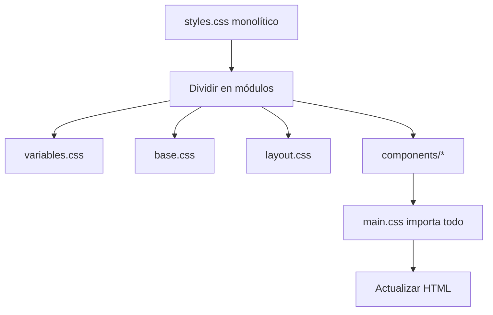

# 📐 Arquitectura CSS Modular de Promptly

## 🎯 **¿Por qué modularizar?**

El archivo `styles.css` original tenía **más de 1600 líneas**, lo que hacía difícil:
- ✅ **Mantener** el código
- ✅ **Encontrar** estilos específicos
- ✅ **Colaborar** en el proyecto
- ✅ **Reutilizar** componentes
- ✅ **Debuggear** problemas de CSS

## 📁 **Nueva Estructura**

```
css/
├── main.css                    # Archivo principal que importa todos los módulos
├── styles.css                  # CSS monolítico original (backup)
└── components/
    ├── variables.css           # Variables CSS y temas
    ├── base.css               # Reset CSS y estilos base
    ├── layout.css             # Sistema de layout y grid
    ├── header.css             # Header y navegación
    ├── buttons.css            # Botones e iconos
    ├── forms.css              # Formularios e inputs
    ├── chat.css               # Chat y mensajes
    ├── settings.css           # Panel de configuración (TODO)
    ├── wizard.css             # Wizard de configuración (TODO)
    ├── code-blocks.css        # Bloques de código (TODO)
    └── utilities.css          # Clases de utilidad (TODO)
```

## 🔧 **Módulos Implementados**

### 1. **variables.css** - Variables CSS y Temas
```css
/* Temas claro y oscuro */
:root { --primary-color: #1976d2; }
[data-theme="dark"] { --primary-color: #667eea; }
```

### 2. **base.css** - Reset y Estilos Base
```css
/* Reset, tipografía, enlaces, utilidades */
*, body, html { /* reset */ }
.hidden, .sr-only { /* utilidades */ }
```

### 3. **layout.css** - Sistema de Layout
```css
/* Grid, flexbox, containers, responsive */
.grid, .flex, .container { /* layout */ }
```

### 4. **header.css** - Header y Navegación
```css
/* Header, logo, navegación, selector de modelo */
.header, .model-selector { /* navegación */ }
```

### 5. **buttons.css** - Botones e Iconos
```css
/* Botones, iconos Material, estados */
.btn, .btn-primary, .icon-btn { /* botones */ }
```

### 6. **forms.css** - Formularios e Inputs
```css
/* Inputs, selects, textarea, validación */
.form-input, .input-area { /* formularios */ }
```

### 7. **chat.css** - Chat y Mensajes
```css
/* Mensajes, burbujas, área de chat */
.message, .chat-container { /* chat */ }
```

## 🚀 **Cómo Usar**

### **Opción 1: CSS Modular (Recomendado)**
```html
<link rel="stylesheet" href="css/main.css">
```

### **Opción 2: CSS Monolítico (Fallback)**
```html
<link rel="stylesheet" href="css/styles.css">
```

## 🛠️ **Desarrollo**

### **Agregar un Nuevo Módulo**

1. **Crea el archivo del módulo**:
```bash
css/components/mi-modulo.css
```

2. **Agrega el import en main.css**:
```css
@import 'components/mi-modulo.css';
```

3. **Usa la convención de nombres**:
```css
/* ========================================
   NOMBRE DEL MÓDULO
   ======================================== */

.mi-componente {
    /* estilos */
}
```

### **Convenciones**

- **Nombres de archivos**: kebab-case (`code-blocks.css`)
- **Nombres de clases**: BEM o kebab-case (`.btn-primary`, `.message-content`)
- **Variables CSS**: kebab-case (`--primary-color`)
- **Comentarios**: Secciones claras con separadores

### **Orden de Imports**

1. **Variables** - Temas y tokens de diseño
2. **Base** - Reset y estilos fundamentales
3. **Layout** - Sistema de diseño y grid
4. **Componentes** - Header, botones, formularios
5. **Utilidades** - Clases helper

## 🔄 **Migración Progresiva**



## ✅ **Ventajas de la Modularización**

- 🎯 **Mantenimiento**: Fácil encontrar y modificar estilos
- 🔄 **Reutilización**: Componentes independientes
- 👥 **Colaboración**: Múltiples desarrolladores sin conflictos
- 📦 **Escalabilidad**: Agregar nuevos módulos sin caos
- 🐛 **Debugging**: Problemas aislados por módulo
- ⚡ **Performance**: Carga selectiva de módulos

## 📋 **TODO - Próximos Módulos**

- [ ] **settings.css** - Panel de configuración
- [ ] **wizard.css** - Wizard de configuración inicial  
- [ ] **code-blocks.css** - Syntax highlighting
- [ ] **animations.css** - Animaciones y transiciones
- [ ] **utilities.css** - Clases helper (margin, padding, etc.)
- [ ] **responsive.css** - Media queries centralizadas

## 🎨 **Mejores Prácticas**

1. **Un módulo, una responsabilidad**
2. **Variables CSS para todo** (colores, espaciado, fuentes)
3. **Mobile-first** en responsive design
4. **Accessibility** en todos los componentes
5. **Performance** - evitar selectores complejos
6. **Consistencia** en naming y estructura

---

**¡CSS modular = Código feliz!** 🎉